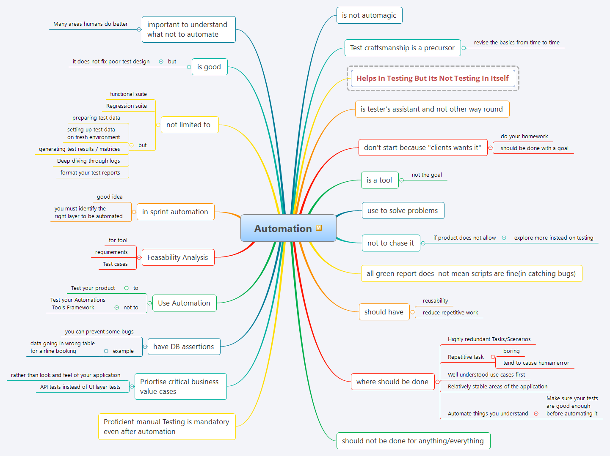

# Tester's Advise on Automation Basics

[click this if you prefer HTML way](https://htmlpreview.github.io/?https://github.com/gauravkhuraana/Testing/blob/main/Automation/Automation%20Must%20know/AutomationBasics.html)

## Table of Contents

- [is not automagic](#is-not-automagic)
- [Test craftsmanship is a precursor](#test-craftsmanship-is-a-precursor)
- [helps in testing but its not testing in itself](#helps-in-testing-but-its-not-testing-in-itself)
- [Proficient manual Testing is mandatory even after automation](#proficient-manual-testing-is-mandatory-even-after-automation)
- [important to understand](#important-to-understand)
- [what not to automate](#what-not-to-automate)
- [is tester's assistant and not other way round](#is-tester-s-assistant-and-not-other-way-round)
- [is a tool](#is-a-tool)
- [use to solve problems](#use-to-solve-problems)
- [all green report does  not mean scripts are fine(in catching bugs)](#all-green-report-does--not-mean-scripts-are-fine-in-catching-bugs-)
- [don't start because "clients wants it"](#don-t-start-because--clients-wants-it-)
- [not to chase it](#not-to-chase-it)
- [should have](#should-have)
- [where should be done](#where-should-be-done)
- [is good](#is-good)
- [not limited to](#not-limited-to)
- [in sprint automation](#in-sprint-automation)
- [Feasability Analysis](#feasability-analysis)
- [Use Automation](#use-automation)
- [have DB assertions](#have-db-assertions)
- [Priortise critical business value cases](#priortise-critical-business-value-cases)

<small><i><a href='http://ecotrust-canada.github.io/markdown-toc/'>Table of contents generated with markdown-toc</a></i></small>

# Automation

## is not automagic

## Test craftsmanship is a precursor
		revise the basics from time to time

## helps in testing but its not testing in itself

## Proficient manual Testing is mandatory even after automation

## important to understand 

## what not to automate
		Many areas humans do better

## is tester's assistant and not other way round

## is a tool
		not the goal

##	use to solve problems

## all green report does  not mean scripts are fine(in catching bugs)
	
## don't start because "clients wants it"

		do your homework
		should be done with a goal

## not to chase it
		if product does not allow
			explore more instead on testing

##	should have

		reusability
		reduce repetitive work

##	where should be done
	
	Highly redundant Tasks/Scenarios
	Repetitive task 
			boring
			tend to cause human error
	Well understood use cases first
	Relatively stable areas of the application
	Automate things you understand
	Make sure your tests are good enough before automating it
	should not be done for anything/everything
	
## is good

		but 
			it does not fix poor test design

## not limited to 
		functional suite
		Regression suite
		but
			preparing test data
			setting up test data on fresh environment
			generating test results / matrices
			Deep diving through logs
			format your test reports

## in sprint automation
		good idea
		you must identify the right layer to be automated

## Feasability Analysis

		for tool
		requirements
		Test cases

## Use Automation

		to
			Test your product
		not to
			Test your Automations Tools Framework

## have DB assertions

		you can prevent some bugs
		example
			data going in wrong table for airline booking

## Priortise critical business value cases
		
		rather than look and feel of your application
		API tests instead of UI layer tests
