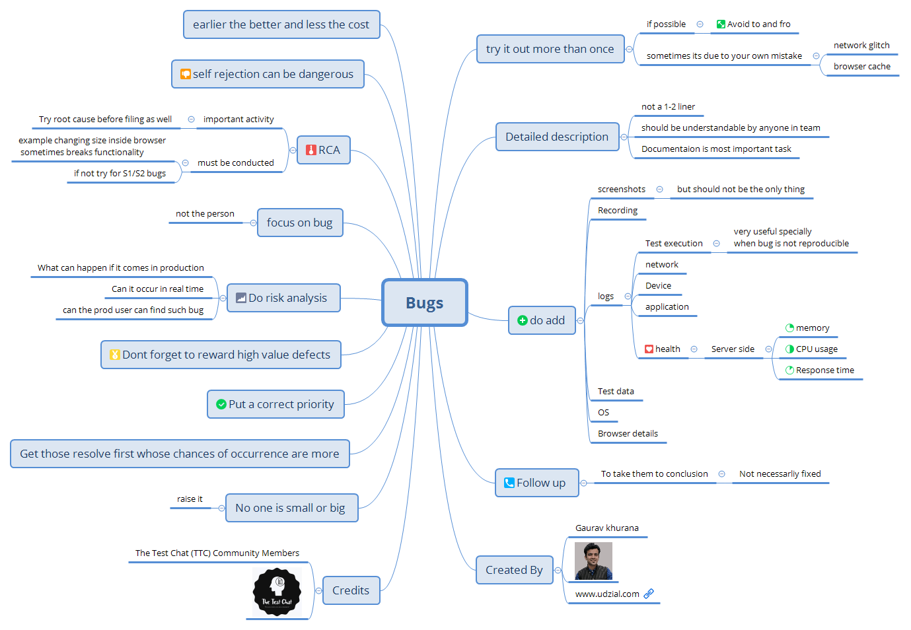

# Bugs in Testing

#### Tester's Tips for Bugs in Testing

[click this if you prefer HTML way and it will look better](https://htmlpreview.github.io/?https://raw.githubusercontent.com/gauravkhuraana/Testing/main/Bugs/Bugs.html)

### What testers think about bugs - bit.ly/testing_bugs

# Bugs
	
## try it out more than once
	
## if possible

		Avoid to and fro
	sometimes its due to your own mistake
		network glitch
		browser cache

## Detailed description

not a 1-2 liner
	should be understandable by anyone in team
	Documentaion is most important task

## do add

###	screenshots
	
	but should not be the only thing

###	Recording
	
###	logs

####	Test execution logs very useful specially when bug is not reproducible

####    network

####	Device 

####	application

####	health

			Server side
				memory
				CPU usage
				Response time
###	Test data

###	OS

###	Browser details

## Follow up 

	To take them to conclusion
		Not necessarliy fixed

## earlier the better and less the cost

## self rejection can be dangerous

## RCA
	
	important activity
		Try root cause before filing as well
	must be conducted
		example changing size inside browser
## sometimes breaks functionality
		if not try for S1/S2 bugs

## focus on bug

	not the person

## Do risk analysis 

	What can happen if it comes in production
	Can it occur in real time
	can the prod user can find such bug

## Dont forget to reward high value defects

## Put a correct priority

## Get those resolve first whose chances of occurrence are more

## No one is small or big 
	raise it

## Created By

Gaurav khurana
	
	www.udzial.com

## Credits
	
	The Test Chat (TTC) Community Members
	
