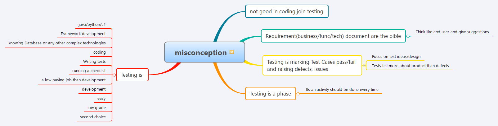

Here's an improved version of your README to make it more interactive and easier to read:

# Tester's Tips on Misconceptions in Testing

[Click here for the HTML version](https://htmlpreview.github.io/?https://github.com/gauravkhuraana/Testing/blob/main/Misconception%20in%20Testing/misconception.html)

---

## Table of Contents

- [Misconceptions in Testing](#misconceptions-in-testing)
  - [Not good in coding? Join testing](#not-good-in-coding-join-testing)
  - [Requirements documents are the bible](#requirements-documents-are-the-bible)
  - [Testing is marking test cases pass/fail and raising defects](#testing-is-marking-test-cases-passfail-and-raising-defects)
  - [Testing is a phase](#testing-is-a-phase)
  - [What testing is not](#what-testing-is-not)

## Misconceptions in Testing

### Not good in coding? Join testing

This is a common misconception. Testing requires understanding of coding to some extent, but it focuses more on critical thinking and problem-solving.

### Requirements documents are the bible

Think like an end user and give suggestions. Requirements documents are important, but they are not infallible.

### Testing is marking test cases pass/fail and raising defects

Focus on test ideas and design. Tests reveal more about the product than just defects.

### Testing is a phase

Testing is an activity that should be done continuously, not just at the end of a development cycle.

### What testing is not

Testing is not:
- Limited to specific languages (e.g., Java, Python, C#)
- Just framework development
- Only about knowing databases or other complex technologies
- Merely coding
- Writing tests without understanding the context
- Running a checklist without critical thinking
- A low-paying job compared to development
- Easier or of lower grade than development
- A second choice career

By understanding these misconceptions, you can better appreciate the critical role of testing in the development process.
